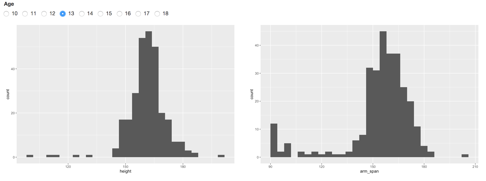
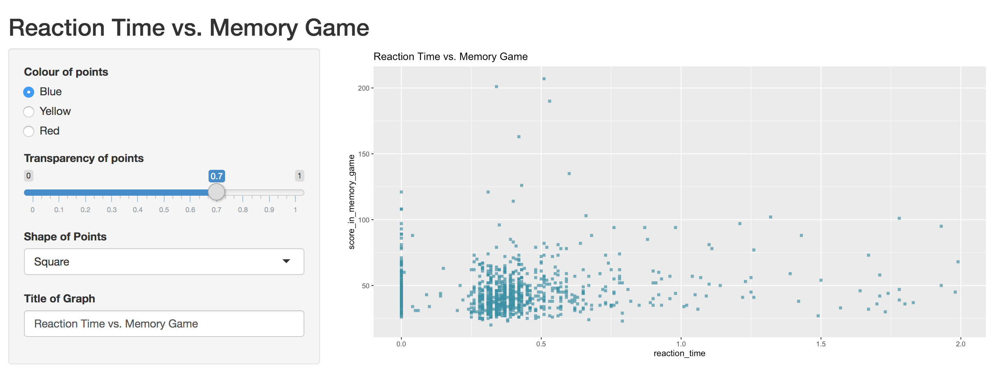
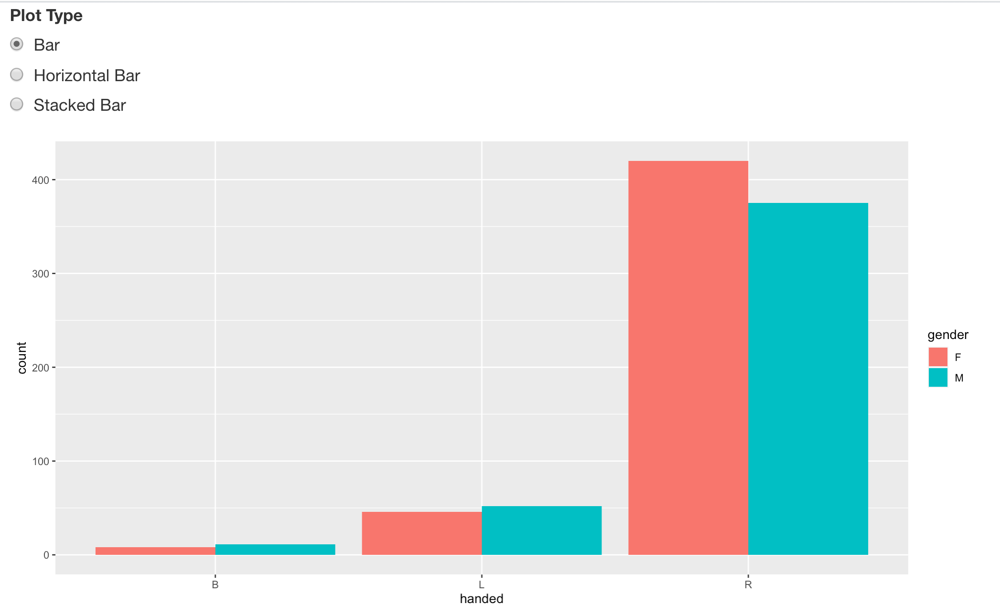
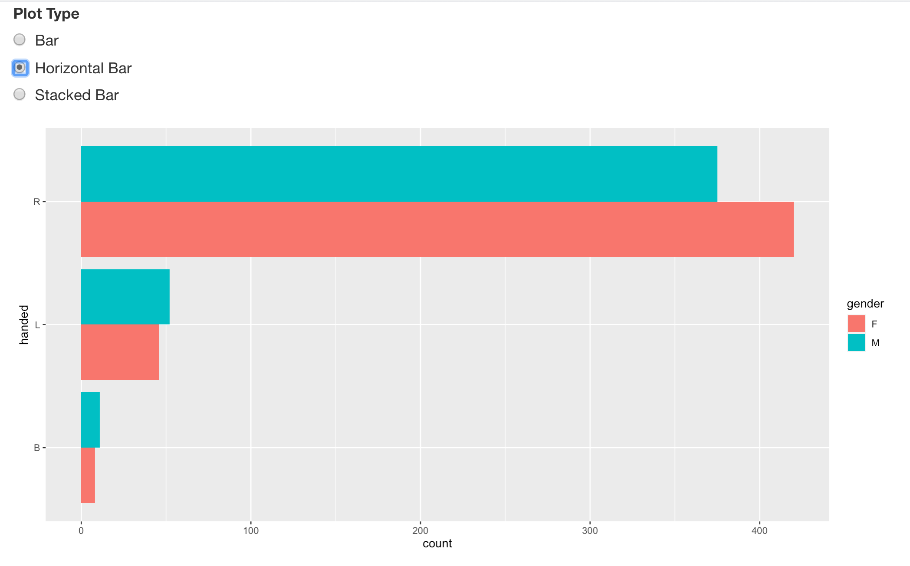
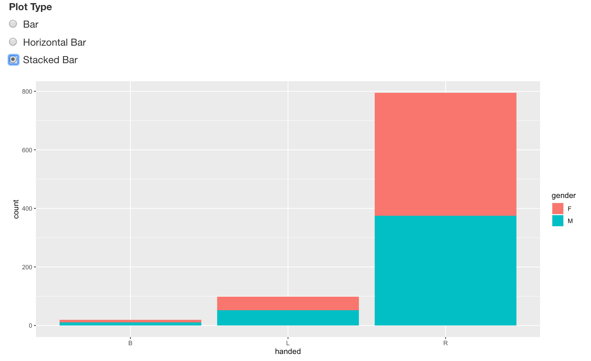
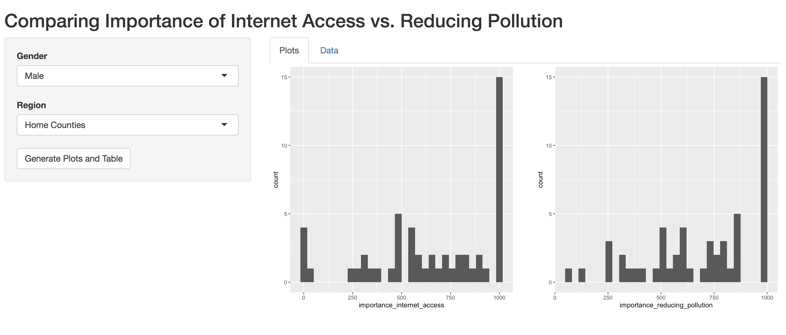
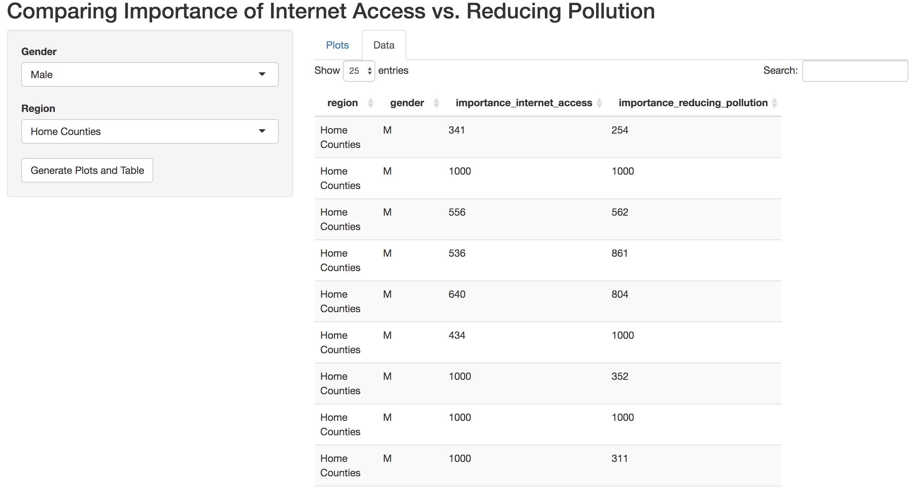
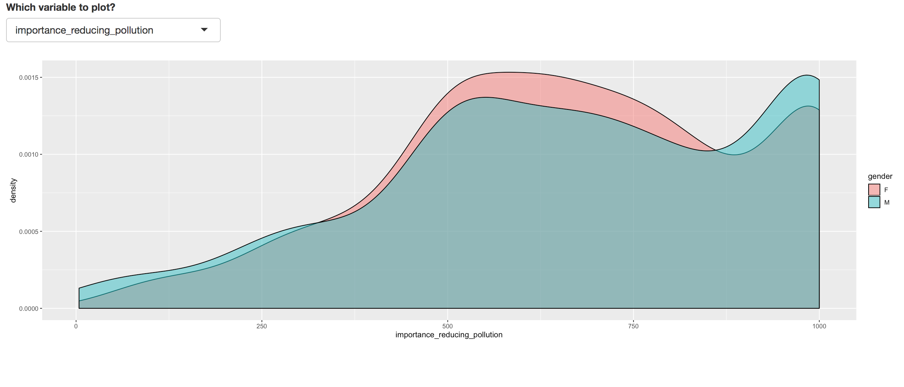
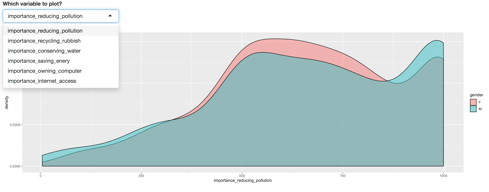

```{r setup, include=FALSE}
knitr::opts_chunk$set(echo = TRUE, fig.align = 'center')
```

**Learning Objectives**<br>

* Get practice applying everything you've learnt about Shiny apps
* Get used to creating an app from a design.

**What this lab contains**

In this lab you are going to be shown several apps, and we want you to recreate them as closely as you can. Throughout this lab you'll use the `students_big` dataset, which is in your data folder. You can think of the image you see as the first stage in our workflow - creating a diagram. Go through the other stages and build up the app.

# Height and Arm Span vs Age

In this app we are plotting two histograms that show the height and arm-span for children of different ages, as chosen by radio buttons on the top of the app.

Hints:

- Use `radioButtons` with `inline = TRUE`, to get horizontal radio buttons.
- This app uses `fluidRow` and `column`
- Both plots use the same data. Can you use `reactive` to make this efficient?



# A customisable scatter plot

Here we are going to change attributes of a scatter plot, without changing the data used to make the scatter plot.

Hints:

- Use a named list inside an input, to display different values that the input takes. For example, for our colour input you will want `choices = c(Blue = "#3891A6", Yellow = "#FDE74C", Red = "#E3655B")`
- The choices for shape are: Square = 15, Circle = 16, Triangle = 17. You will need to force the the input value to be numeric inside the graph. Outputs of `selectInput` are character by default. 
- There's a text box under "Title of the Graph" where the text input which will change the title of the graph. `ggtitle` is the easiest way to add the title to a graph. 
- This uses the sidebar layout



# Three different plot options

The app has three different options to show the same data: a bar chart, a pie chart and a stacked bar chart.

Hints:

- You will need to use if-statements inside server to do this. You can use if statements inside `renderPlot`. Remember that the last thing `renderPlot` should return is the plot you want to make.






# An app with tabs

This Shiny application has tabs, here's how it looks in both tabs:

Hints:

- There's lots of different regions in this data set. You will probably want to use `unique` to find the different regions in the data to use in the input.
- The plots and tables don't update until the button "Update Plots and Table" is pressed.
- The plot and the data both use the same dataset.
- The table in the data table uses `dataTableOutput`.
- The two plots here are done with two separate plot outputs. However, it would be possible to create this using faceting.
- This app uses sidebar layout, tab panels and fluid row (for the plots).




# A trickier one - how do we change `ggplot2` variables?

Here we have a basic app with only one plot. What's tricky is that we can choose between plotting each of the 6 "importance" variables.

Hints:

- When you select a variable using `selectInput`, it returns a string instead of a name.
- If you use `aes_string` instead of `aes`, then you can accept strings instead of name in `ggplot`.
- This plots are made with `geom_density`, with `alpha = 0.5`.
- For more complicated situations like this - when you are working with names, rather than values - you might need to learn about `tidyeval`. 
- Here's some resources on `tidyeval` if you are interested:
  * short video https://www.youtube.com/watch?v=nERXS3ssntw
  * section of book https://tidyeval.tidyverse.org/sec-why-how.html 



